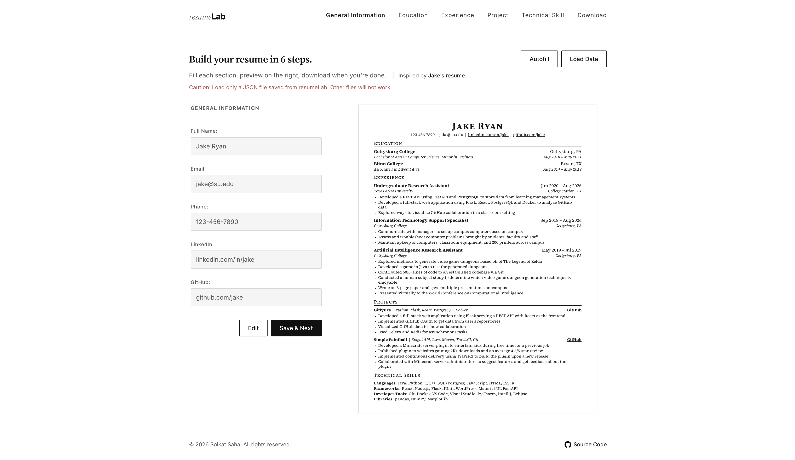

# resume<span style="font-weight: 800; color: #111;">Lab</span>

A browser-based résumé builder especially designed for computer science students and professionals: fill out six short forms while a **letter-size preview** updates on the right, then save your data or print the résumé. Walk through **General Information**, **Education**, **Experience**, **Project**, **Technical Skill**, and **Download**. Add or remove schools, jobs, and projects; lock a section after save and hit **Edit** to change it. The formatting style is inspired by [Jake’s résumé](https://github.com/jakegut/resume).

There is no backend. Everything runs in the browser: **Vite** bundles **React** and CSS, and résumé state lives in memory for the session. **Autofill** loads a sample résumé and allows to start editing from there. **Load Data** restores a JSON file you saved earlier; **Save Data** downloads `resume.json`; **Download** opens the print dialog so you can **Save as PDF**. Dates are stored as `yyyy-MM` and shown as `MMM yyyy` on the page.

This web version of a résumé builder was built as part of the **The Odin Project** curriculumn (thanks to **The Odin Project** community), with layout inspired by Jake’s template and my own black-and-white editorial styling. If you are reading the repo, you will see how **App** owns the step index, **Body** owns `resumeData`, forms keep local fields until Save & Next, and the preview components only read data — plus how Autofill and Load remount the current form with a `key` so inputs pick up the new object.

### What’s on `main` (current code)

The **default branch** is a Vite + React app. The important pieces:

- **`App`** — header, footer, and which form step is showing
- **`Body`** — `resumeData`, Autofill, Load Data, and the form + preview layout
- **`Resume`** — letter preview: header plus education, experience, projects, and skills
- **Form steps** — `GeneralInfo`, `Education`, `Experience`, `Project`, `TechnicalSkill`, `Download`
- **`SectionRail`** — step labels in the header (highlight only, not clickable)

The UI is bundled with **Vite** (dev server, production build). Styling is plain CSS modules of a sort: tokens, layout, form fields, and print rules — no CSS-in-JS.

<p align="center">
  
</p>

## Getting Started

### **Try it online**

**Live app:** [https://resume-lab-dev.vercel.app/](https://resume-lab-dev.vercel.app/) — opens in the browser; no account or backend required.

### **Run it locally** (if you are cloning or tweaking the code)

You need **Node.js** and **npm** for the Vite dev server and production build.

#### **Prerequisites**

- **Node.js** (LTS recommended) and **npm**
- **Git** (only if you use `git clone` below; otherwise use GitHub **Code → Download ZIP**)

#### Check that Git is installed (only if you clone)

```bash
git --version
```

#### **Installing**

##### 1. Clone this repository and open the project directory

```bash
git clone https://github.com/soikat27/resume-lab.git
```

```bash
cd resume-lab
```

##### 2. Install dependencies

```bash
npm install
```

#### **Running locally**

Start the development server (opens in the browser):

```bash
npm run dev
```

#### **Production build**

```bash
npm run build
```

Built files are written to `dist/` (gitignored). Preview the build with `npm run preview`, or let **Vercel** run the same build from the repo.

## Using the app

The same behavior applies on the [live demo](https://resume-lab-dev.vercel.app/) and when you run the dev server locally.

### Features

- **Six-step builder** — general info, education, experience, projects, technical skills, download
- **Live letter preview** — Jake-style sections update as you save each step
- **Add / remove entries** — multiple schools, jobs, and projects; extra duties and highlights
- **Edit after save** — a step locks when it has data; **Edit** turns typing back on
- **Autofill** — sample résumé (Gettysburg College + Jake-inspired content) for trying the UI
- **Load Data** — restore a JSON file saved from resumeLab
- **Save Data** — download `resume.json` before you print
- **Download** — print dialog; choose **Save as PDF** for a file copy of the preview
- **Print stylesheet** — app chrome hidden; résumé on a letter page

### Usage

- Open the app → fill **General Information** → **Save & Next**
- Add education, experience, and projects as needed; use **+** / **–** on lists
- Fill technical skills → **Download**
- Optional (`highly recommended`): **Save Data** for a JSON backup; **Load Data** later instead of retyping
- **Download** → print → **Save as PDF**
- **Autofill** anytime to see a full preview; **Previous** to revisit a step

### Upcoming features

- **Stricter Load Data checks** — reject files that are not resumeLab JSON before they hit the preview

## Available Scripts

- `npm run dev` — Vite dev server
- `npm run build` — production build into `dist/`
- `npm run preview` — serve the production build locally
- `npm run lint` — ESLint

## Deployment

This project is hosted on **Vercel**. Connecting the GitHub repo is enough: Vercel runs `npm run build` and serves the output. `dist/` stays out of git.

**Live site:** [https://resume-lab-dev.vercel.app/](https://resume-lab-dev.vercel.app/)

You could also host the same `dist/` output on Netlify, Cloudflare Pages, or GitHub Pages.

## Built with

- **React 19** — function components and hooks
- **Vite 8** — dev server and production bundle
- **CSS** — tokens, layout, form, preview, and print (`@page` / `@media print`)
- **date-fns** — parse and format month dates
- **Inter** and **Source Serif 4** — bundled variable fonts
- [Jake’s résumé](https://github.com/jakegut/resume) as the preview layout reference

## Contributing

Contributions are welcome and appreciated. Open an issue or send a PR if you want to tighten validation, improve print pagination, or teach me something I missed.

## Author

- **Soikat Saha** — design and implementation

## License

This project is licensed under the MIT License — see the [LICENSE](LICENSE) file for details.

## Acknowledgments

- Shoutout to the **Odin Project** community and curriculum for guidance.
- [Jake Gutierrez’s résumé](https://github.com/jakegut/resume) — section structure and typography the preview aims at.
- Thanks to everyone who maintains solid **MDN** docs — print CSS, `FileReader`, and `Blob` downloads got plenty of use.
